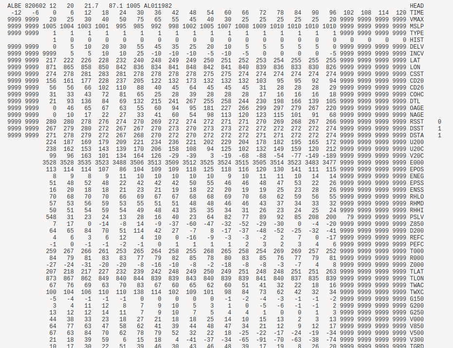

# bda-hurricane-modeling
Course project for the Aalto Bayesian Data Analysis 2020 course.

## Idea

Under `data` there is a dataset `atl-ships-data.csv` with ~130 covariates and the outcome variable of interest, 
`VMAX`.

The idea is to formulate a Bayesian model for **future values of VMAX**. In the American NHC (National Hurricane 
Center) they do this using a multiple regression model, we should start out with something like this as well.

### What even is all of this

Hurricanes (aka tropical cyclones) work something like this: when a low-pressure point has formed in a tropical 
region (over sea), this leads to winds flowing to that point. Due to the spinning motion of the Earth, this leads
to a circular motion around the point (= cyclone). The cyclonic motion also leads to a counter-force in the form 
of the centrifugal force. There is a kind of 'critical' circular region where the force pushing winds into the 
center is balanced by the centrifugal force - this leads to a natural circle shape which is called the 'eyewall' 
of the hurricane. And inside of this circle is the region called the 'eye' of the storm. Winds are less intense 
inside the eye, but in the eyewall winds can be very destructive, and the wind strength falls slowly on the 
outside of the eye.

In short, we want to model changes of the wind intensity in the eyewall, this is the `VMAX` variable. 
So this leads to the question: what leads hurricanes to intensify, or to weaken? There are some variables which 
are known to be important. Unfortunately not all is well-understood by meteorologists, but there are some 
core principles:

- high sea temperatures (>28 deg C) cause convection, which can lower the pressure in the eye, leading to more force pushing winds into the eye
- strong wind shear (differences between winds low and high in the atmosphere) can destabilize the storm, making it more difficult to intensify
- high humidity is a good condition for convection

In the SHIPS dataset there are variables representing all of this, so we should easily be able to get a minimal 
model for intensity change.

### On the data

To understand the data, you first need to understand a few basics.

- ID: this is a storm ID assigned by the WMO (World Meteorological Org)
- TIME: ISO formatted date and hour: YYYY-MM-DD HH
- VMAX: given in knots; rounded to nearest multiple of 5 (real-time observations are not very precise)
- MSLP: minimum sea-level pressure; actually a kind of alternative to VMAX since intensity and pressure correlate

Further, in the SHIPS data the value 9999 is used for NA. Just keep this in mind when loading the data into R.

Another thing to remember is that the values are all stored in integer form (a trick to save storage space, I think).
So for example, the `CSST` variable is 274 when the sea-surface temperature is 27.4 Celsius.

Most of the variables are difficult to understand for non-meteorologists. I have included a list of variables 
from the SHIPS website (docx format). The list does not really explain everything well, but it gives some info.
If you want to get a deeper understanding you can try reading the first scientific publication about the SHIPS model.
I have included the article in the project folder. Just keep in mind that the scientific publications are full 
of jargon and we are mostly here to do some analysis on one data set, so we don't need to know everything.

### I have processed the SHIPS data

Here is how the SHIPS data looked at first:

So you see that they had a weird column system. Well, the important data is under TIME = 0 in this format, so I 
extracted that column for every time step and saved to to a data frame. If you want to check what I did, see the 
file `data_processing.r`, a file where I wrote some functions with vanilla R to do the work.
The final CSV data is now saved in the path 
`data/atl-ships-data.csv`. 
